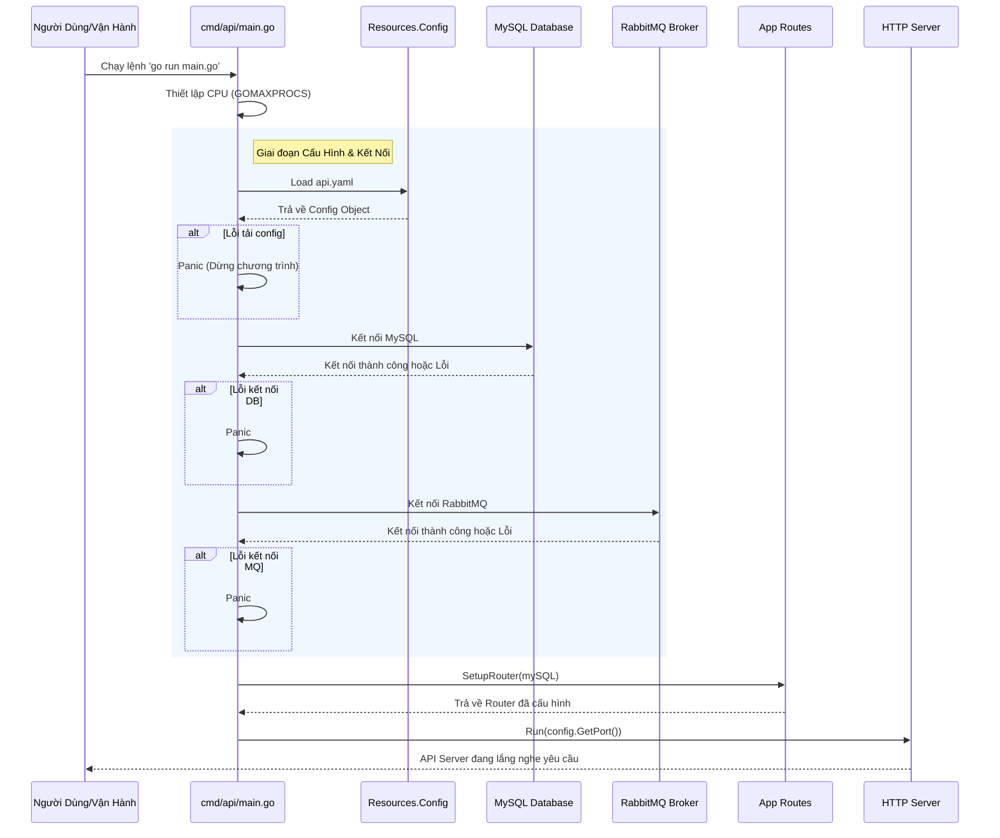

# Tài Liệu Khởi Động Dịch Vụ API (API Service Entry Point)

## 1. Tổng Quan (Overview)

### Đối với Người Dùng Kỹ Thuật (Technical Users)
File `cmd/api/main.go` là điểm vào chính (Entry Point) của ứng dụng backend. Nó chịu trách nhiệm khởi tạo môi trường chạy, thiết lập cấu hình, kết nối cơ sở dữ liệu (MySQL), kết nối hàng đợi tin nhắn (RabbitMQ), và cuối cùng là khởi động máy chủ HTTP thông qua bộ định tuyến (Router).

### Đối với Người Dùng Phi Kỹ Thuật (Non-Technical Users)
Hãy tưởng tượng đây là **"Phím Nguồn"** của một nhà hàng. Trước khi phục vụ khách (người dùng), bếp trưởng cần:
1.  Kiểm tra danh sách nguyên liệu (Cấu hình).
2.  Mở kho lạnh (Kết nối Database).
3.  Gọi điện cho nhà cung cấp đồ ăn nhanh (Kết nối RabbitMQ).
4.  Sắp xếp bàn ghế và gọi nhân viên ra đón khách (Setup Router).
5.  Mở cửa kinh doanh (Run Server).

Nếu bước nào thất bại, nhà hàng sẽ không thể mở cửa (Ứng dụng báo lỗi/Panic).

---

## 2. Luồng Khởi Tạo Hệ Thống (System Startup Flow)

Biểu đồ dưới đây mô tả trình tự các bước xảy ra khi bạn chạy lệnh khởi động dịch vụ.



---

## 3. Chi Tiết Các Thành Phần (Component Details)

### 3.1. Quản Lý Hiệu Suất (Runtime Optimization)
```go
runtime.GOMAXPROCS(runtime.NumCPU())
```
*   **Mô tả:** Thiết lập số lượng lõi CPU tối đa mà Go runtime có thể sử dụng.
*   **Lý do:** Đảm bảo ứng dụng tận dụng tối đa sức mạnh phần cứng của máy chủ để xử lý nhiều yêu cầu đồng thời.

### 3.2. Tải Cấu Hình (Configuration Loading)
```go
resource := resources.NewIMResource()
config, err := resource.Config(args, "api.yaml")
```
*   **File cấu hình:** `api.yaml`
*   **Chức năng:** Đọc các thông số như Port, địa chỉ Database, thông tin RabbitMQ từ file YAML.
*   **Xử lý lỗi:** Nếu file không tồn tại hoặc sai cú pháp, hệ thống sẽ dừng ngay lập tức (`panic(err)`).

### 3.3. Kết Nối Cơ Sở Dữ Liệu (MySQL Connection)
```go
mySQL, err := resource.MySQLConn()
```
*   **Vai trò:** Tạo kết nối bền vững với MySQL để lưu trữ dữ liệu nghiệp vụ.
*   **Yêu cầu:** Máy chủ phải cài đặt MySQL và thông tin đăng nhập đúng trong `api.yaml`.

### 3.4. Kết Nối Hàng Đợi Tin Nhắn (RabbitMQ Connection)
```go
rabbitMQConn, err := resource.RabbiMQConn()
if rabbitMQConn != nil {
    defer rabbitMQConn.Close()
}
```
*   **Vai trò:** Kết nối với RabbitMQ để xử lý các tác vụ bất đồng bộ (ví dụ: gửi email, xử lý đơn hàng nền).
*   **Quản lý tài nguyên:** Sử dụng `defer` để đảm bảo kết nối đóng lại an toàn khi ứng dụng tắt.

### 3.5. Khởi Động Máy Chủ (Server Start)
```go
router := routes.SetupRouter(mySQL)
router.Run(config.GetPort())
```
*   **Routes:** Tất cả các đường dẫn API cụ thể (như `/login`, `/products`) được định nghĩa trong package `app/routes`.
*   **Port:** Lấy từ file cấu hình `api.yaml`.

---

## 4. Hướng Dẫn Sử Dụng (Usage Guide)

### 4.1. Yêu Cầu Hệ Thống (Prerequisites)
Trước khi chạy, hãy đảm bảo:
1.  Đã cài đặt **Go Language**.
2.  Đã cài đặt và chạy **MySQL**.
3.  Đã cài đặt và chạy **RabbitMQ**.
4.  File `api.yaml` nằm cùng thư mục hoặc đường dẫn tương đối đúng.

### 4.2. Lệnh Chạy (Command Line)
Để khởi động dịch vụ API, sử dụng lệnh sau trong terminal:

```bash
cd cmd/api
go run main.go
```

Hoặc nếu đã build thành binary:
```bash
./api_server
```

### 4.3. Kiểm Tra Trạng Thái Dịch Vụ (Health Check)
Sau khi dịch vụ chạy thành công, bạn có thể kiểm tra xem API có đang hoạt động không bằng cách gửi một yêu cầu thử nghiệm.

*Lưu ý: Endpoint cụ thể phụ thuộc vào file `routes/*.go`, nhưng thường sẽ có một endpoint gốc.*

**Ví dụ CURL:**
```bash
# Giả sử dịch vụ chạy trên port 8080
curl -X GET http://localhost:8080/health
```

**Đầu ra mong đợi (Success):**
```json
{
  "status": "ok",
  "message": "API Service is running",
  "timestamp": "2023-10-27T10:00:00Z"
}
```

**Đầu ra lỗi (Failure):**
```text
curl: (7) Failed to connect to localhost port 8080: Connection refused
```
*(Nguyên nhân: Dịch vụ chưa chạy hoặc bị crash ở bước khởi tạo)*

---

## 5. Xử Lý Sự Cố (Troubleshooting)

Dựa trên mã nguồn, dưới đây là các lỗi phổ biến có thể xảy ra:

| Lỗi | Nguyên Nhân Có Thể | Cách Khắc Phục |
| :--- | :--- | :--- |
| **Panic: Config Error** | File `api.yaml` thiếu hoặc sai định dạng. | Kiểm tra cú pháp YAML và đảm bảo file tồn tại. |
| **Panic: MySQL Error** | Sai username/password hoặc MySQL chưa chạy. | Kiểm tra thông tin trong `api.yaml` và trạng thái MySQL service. |
| **Panic: RabbitMQ Error** | RabbitMQ chưa chạy hoặc sai host/port. | Kiểm tra RabbitMQ management console và cấu hình kết nối. |
| **Connection Refused** | Port đã bị chiếm dụng bởi ứng dụng khác. | Thay đổi port trong `api.yaml` hoặc kill tiến trình đang chiếm port. |

---

## 6. Lưu Ý Về Bảo Mật (Security Notes)

1.  **Thông tin nhạy cảm:** Không commit file `api.yaml` chứa mật khẩu thật lên Git Public. Hãy sử dụng biến môi trường (Environment Variables) hoặc Secret Manager trong production.
2.  **Error Handling:** Hiện tại code sử dụng `panic` để dừng chương trình khi gặp lỗi nghiêm trọng. Trong môi trường Production, nên cân nhắc ghi log chi tiết trước khi dừng để dễ dàng debug.

---

## 7. Tham Khảo Thêm (References)

*   **Package Routes:** Xem chi tiết các API endpoint trong thư mục `app/routes/`.
*   **Package Resources:** Xem chi tiết logic kết nối DB/MQ trong thư mục `app/resources/`.