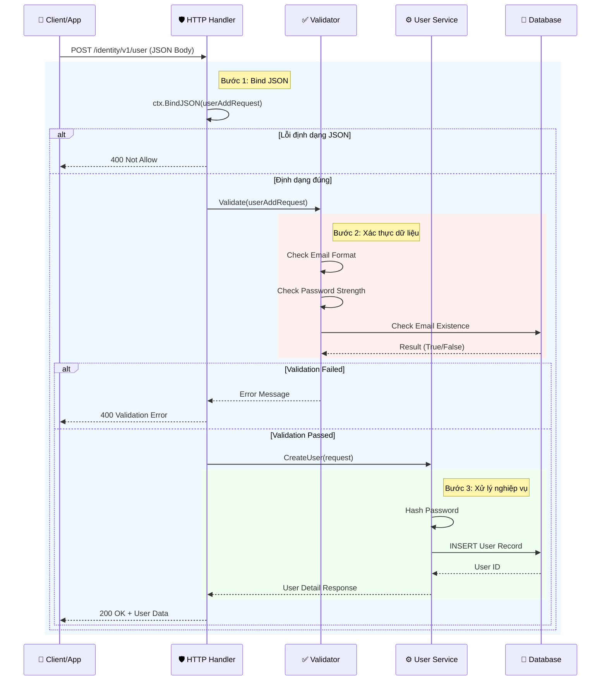

# 📄 Tài Liệu API: Tạo Người Dùng Mới (Create User)

## 1. 📖 Tổng Quan (Overview)

### API này làm gì?
API này cho phép hệ thống đăng ký một tài khoản người dùng mới. Khi một người dùng muốn tham gia vào hệ thống, họ sẽ gửi thông tin cá nhân của mình qua API này để tạo hồ sơ.

### Đối tượng sử dụng
*   **Người dùng cuối:** Sử dụng ứng dụng di động hoặc web để đăng ký.
*   **Nhà phát triển (Developer):** Tích hợp chức năng đăng ký vào hệ thống khác hoặc tự động hóa quy trình tạo tài khoản.
*   **Quản trị viên:** Hiểu cách dữ liệu người dùng được lưu trữ ban đầu.

---

## 2. ⚙️ Thông Tin Kỹ Thuật (Technical Details)

| Thuộc tính | Giá trị |
| :--- | :--- |
| **Tên API** | Create User (Tạo người dùng) |
| **Endpoint** | `/identity/v1/user` |
| **Phương thức** | `POST` |
| **Module** | Identity (v1) |
| **Auth Required** | Không (Public) |
| **Content-Type** | `application/json` |

### 🌐 Mô tả luồng xử lý
Khi yêu cầu được gửi đi, hệ thống sẽ thực hiện các bước sau:
1.  **Tiếp nhận:** Nhận dữ liệu từ client.
2.  **Kiểm tra định dạng:** Đảm bảo dữ liệu đúng chuẩn JSON.
3.  **Xác thực (Validation):** Kiểm tra tính hợp lệ của dữ liệu (ví dụ: email đã tồn tại chưa, mật khẩu đủ mạnh chưa).
4.  **Xử lý nghiệp vụ:** Lưu thông tin vào cơ sở dữ liệu.
5.  **Trả kết quả:** Trả về thông tin người dùng vừa tạo hoặc lỗi nếu có.

---

## 3. 📥 Tham Số Yêu Cầu (Request Parameters)

### Query Parameters (Tham số truy vấn)
Các tham số được truyền trong URL.

| Tên | Kiểu | Bắt buộc | Mô tả | Giá trị mẫu |
| :--- | :--- | :--- | :--- | :--- |
| `lang` | String | Không | Ngôn ngữ phản hồi lỗi/thông báo | `en`, `vi` |

### Body Parameters (Nội dung yêu cầu)
Dữ liệu chính được gửi trong thân yêu cầu (JSON). Cấu trúc dựa trên `schema.UserAddRequest`.

| Tên trường | Kiểu dữ liệu | Bắt buộc | Mô tả | Ví dụ |
| :--- | :--- | :--- | :--- | :--- |
| `username` | String | Có | Tên đăng nhập duy nhất | `lich_tv` |
| `email` | String | Có | Địa chỉ email hợp lệ | `lich@example.com` |
| `password` | String | Có | Mật khẩu (tối thiểu 8 ký tự) | `Password123!` |
| `full_name` | String | Có | Họ và tên đầy đủ | `Trần Văn Lich` |
| `phone` | String | Không | Số điện thoại liên hệ | `0901234567` |

> **⚠️ Lưu ý:** Các trường cụ thể trong Body phụ thuộc vào định nghĩa chi tiết trong `schema/UserAddRequest.go`. Bảng trên là cấu trúc tiêu chuẩn dự kiến.

---

## 4. 💻 Ví Dụ Gọi API (CURL Examples)

### ✅ Trường hợp thành công (Success Case)

```bash
curl --location 'https://api.example.com/identity/v1/user' \
--header 'Content-Type: application/json' \
--data '{
    "username": "lich_tv",
    "email": "lich@example.com",
    "password": "SecurePass123!",
    "full_name": "Trần Văn Lich",
    "phone": "0901234567"
}'
```

### ❌ Trường hợp thất bại (Error Case - Email tồn tại)

```bash
curl --location 'https://api.example.com/identity/v1/user?lang=vi' \
--header 'Content-Type: application/json' \
--data '{
    "username": "lich_tv_duplicate",
    "email": "lich@example.com",
    "password": "SecurePass123!"
}'
```

---

## 5. 📤 Phản Hồi (Responses)

### 200 OK - Thành công
Hệ thống đã tạo tài khoản thành công.

```json
{
    "code": 200,
    "message": "success",
    "data": {
        "id": "usr_1234567890",
        "username": "lich_tv",
        "email": "lich@example.com",
        "full_name": "Trần Văn Lich",
        "created_at": "2023-10-27T10:00:00Z",
        "status": "active"
    }
}
```

### 400 Bad Request - Sai định dạng hoặc xác thực
Dữ liệu gửi lên không đúng chuẩn hoặc vi phạm quy tắc.

```json
{
    "code": 400,
    "message": "validation_failed",
    "errors": [
        {
            "field": "email",
            "message": "Email đã được sử dụng"
        }
    ]
}
```

### 500 Internal Server Error - Lỗi hệ thống
Lỗi xảy ra bên phía server (cơ sở dữ liệu, mạng lưới...).

```json
{
    "code": 500,
    "message": "internal_server_error",
    "error": "Failed to connect to database"
}
```

---

## 6. 🔄 Luồng Xử Lý Chi Tiết (Sequence Diagram)

Biểu đồ dưới đây minh họa tương tác giữa các thành phần khi API được gọi.



---

## 7. 📝 Ghi Chú Quan Trọng (Notes)

1.  **Bảo mật:** Mật khẩu (`password`) luôn phải được mã hóa (hash) trước khi lưu vào cơ sở dữ liệu. API không bao giờ trả về mật khẩu gốc trong response.
2.  **Ngôn ngữ:** Nếu không truyền tham số `lang`, hệ thống mặc định trả về tiếng Anh (`en`).
3.  **Giới hạn tốc độ (Rate Limiting):** Để tránh spam, endpoint này có thể bị giới hạn số lần gọi từ cùng một IP trong một khoảng thời gian nhất định.
4.  **Schema Version:** API này thuộc phiên bản `v1`. Các thay đổi lớn trong tương lai sẽ được đưa vào `v2` để đảm bảo tính ổn định cho các tích hợp cũ.