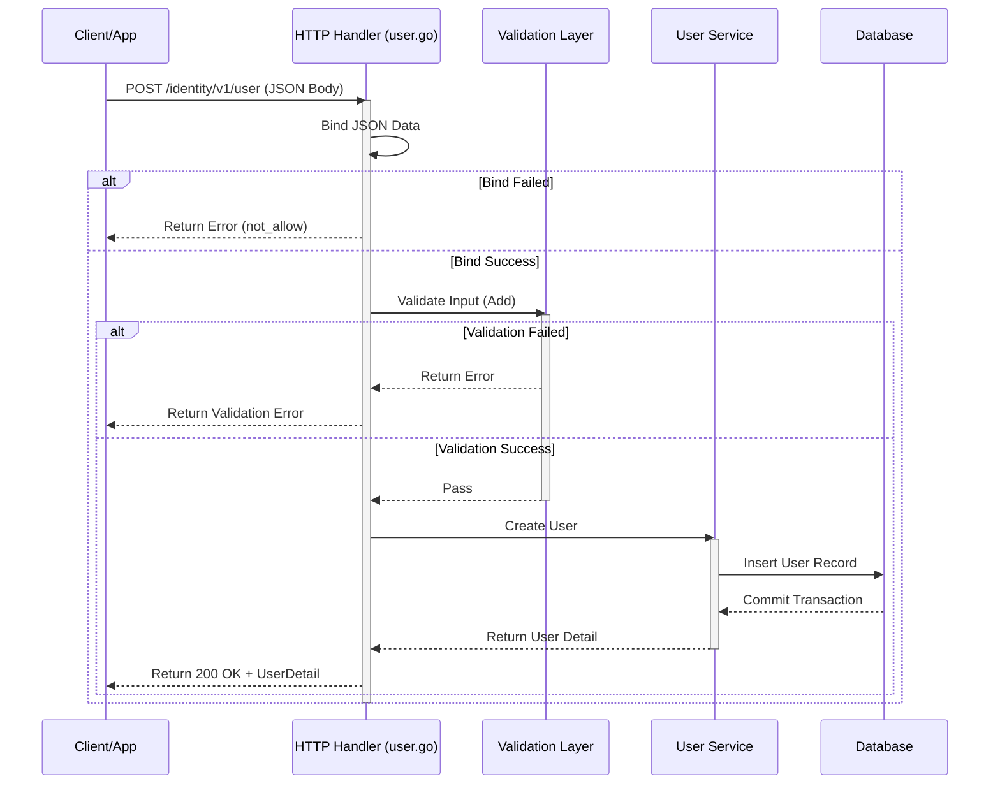

# API Tài Khoản Người Dùng: Tạo Người Dùng Mới

## 1. Tổng quan (Overview)

**Mục đích:**  
API này cho phép hệ thống tạo một tài khoản người dùng mới trong cơ sở dữ liệu quản lý danh tính (Identity Management). Đây là bước đầu tiên để một người dùng có thể đăng nhập và sử dụng các dịch vụ của hệ thống.

**Đối tượng sử dụng:**  
- **Người dùng cuối:** Cần đăng ký tài khoản mới.
- **Nhà phát triển (Developer):** Cần tích hợp chức năng đăng ký vào ứng dụng Frontend hoặc Mobile App.

---

## 2. Thông tin Endpoint

| Thuộc tính | Giá trị |
| :--- | :--- |
| **Phương thức** | `POST` |
| **Đường dẫn (Path)** | `/identity/v1/user` |
| **Nhóm (Tag)** | `identity` |
| **Accept** | `application/json` |
| **Produce** | `application/json` |

---

## 3. Tham số đầu vào (Request Parameters)

### 3.1. Tham số Query (Optional)

Tham số được gửi kèm theo URL để tùy chỉnh phản hồi.

| Tên tham số | Kiểu dữ liệu | Bắt buộc | Mô tả | Giá trị mặc định |
| :--- | :--- | :--- | :--- | :--- |
| `lang` | String | Không | Ngôn ngữ hiển thị thông báo lỗi/thành công | `vi` |
| **Giá trị cho phép** | | | `en`, `vi` | |

### 3.2. Thân yêu cầu (Body)

Dữ liệu người dùng cần cung cấp để tạo tài khoản. Cấu trúc tuân theo schema `UserAddRequest`.

```json
{
  "username": "string",
  "email": "string",
  "password": "string",
  "full_name": "string"
}
```

> **Lưu ý:** Các trường cụ thể trong `UserAddRequest` phụ thuộc vào định nghĩa schema thực tế trong dự án. Ví dụ trên là các trường phổ biến.

---

## 4. Phản hồi (Response)

### 4.1. Thành công (Success - 200 OK)

Khi người dùng được tạo thành công, hệ thống trả về đối tượng `UserDetailResponse`.

```json
{
  "code": 200,
  "message": "success",
  "data": {
    "id": "uuid-hoặc-id-số",
    "username": "lich_tv",
    "email": "lich@example.com",
    "created_at": "2023-10-27T10:00:00Z"
  }
}
```

### 4.2. Thất bại (Error)

Nếu xảy ra lỗi (thiếu dữ liệu, định dạng sai, trùng tên...), hệ thống sẽ trả về mã lỗi tương ứng.

```json
{
  "code": 400,
  "message": "not_allow",
  "data": null
}
```

---

## 5. Ví dụ CURL (Curl Example)

Dưới đây là ví dụ cách gọi API bằng lệnh CURL từ terminal.

```bash
curl --location 'https://api.example.com/identity/v1/user?lang=vi' \
--header 'Content-Type: application/json' \
--data '{
    "username": "lich_tv",
    "email": "lich@example.com",
    "password": "SecurePassword123!",
    "full_name": "Lich TV"
}'
```

---

## 6. Luồng xử lý (Sequence Diagram)

Biểu đồ dưới đây mô tả luồng đi của dữ liệu khi API nhận yêu cầu tạo người dùng mới.



---

## 7. Hướng dẫn xử lý lỗi (Troubleshooting)

| Mã lỗi (Code) | Nguyên nhân | Cách khắc phục |
| :--- | :--- | :--- |
| `400` | Dữ liệu gửi lên không đúng định dạng JSON hoặc thiếu trường bắt buộc. | Kiểm tra lại cấu trúc Body request. |
| `400` | Validation lỗi (ví dụ: Email không hợp lệ, Password quá ngắn). | Đọc thông báo `message` chi tiết từ server. |
| `409` | Tài khoản đã tồn tại (Username hoặc Email trùng). | Yêu cầu người dùng chọn tên khác. |
| `500` | Lỗi nội bộ server. | Liên hệ đội ngũ vận hành (DevOps/Backend). |

---

## 8. Ghi chú kỹ thuật (Technical Notes)

- **Bảo mật:** Mật khẩu (`password`) nên được mã hóa trước khi gửi qua mạng (HTTPS) và luôn được băm (hash) ở phía Server trước khi lưu vào Database.
- **Idempotency:** API này không đảm bảo tính idempotent. Gọi nhiều lần với cùng dữ liệu có thể tạo ra nhiều tài khoản nếu không kiểm soát trùng lặp ở lớp Service.
- **Versioning:** API đang ở phiên bản `v1`. Các thay đổi lớn trong tương lai sẽ được nâng lên `v2`.