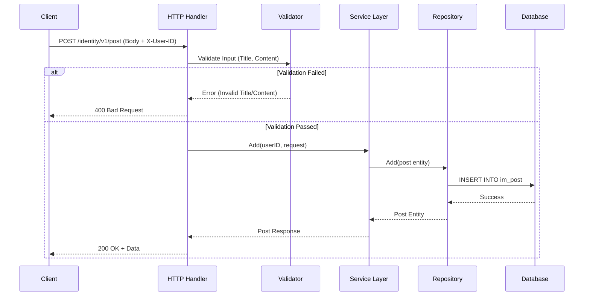

# Tài Liệu API - Quản Lý Bài Viết (Post Management)

## 1. Tổng Quan (Overview)

Module **Identity - Post** cung cấp các chức năng cơ bản để quản lý nội dung bài viết (CRUD) trong hệ thống. API này cho phép người dùng đăng ký, tạo, xem, chỉnh sửa và xóa các bài viết cá nhân.

### Đối tượng sử dụng
*   **Người dùng cuối (Non-tech):** Hiểu được cách hệ thống lưu trữ và hiển thị bài viết của họ.
*   **Nhà phát triển (Tech):** Hiểu rõ cấu trúc API, luồng xử lý, định dạng dữ liệu và các mã lỗi để tích hợp hoặc bảo trì.

### Cơ chế xác thực
Tất cả các yêu cầu liên quan đến bài viết đều yêu cầu xác thực người dùng thông qua header `X-User-ID`. ID này đại diện cho người sở hữu bài viết.

---

## 2. Mô Hình Dữ Liệu (Data Model)

Dữ liệu bài viết được lưu trữ trong bảng `im_post` của cơ sở dữ liệu MySQL.

### Cấu trúc bảng `im_post`

| Trường (Field) | Kiểu dữ liệu | Mô tả |
| :--- | :--- | :--- |
| `id` | `int(11)` | Khóa chính, tự tăng (Primary Key). |
| `user_id` | `int(11)` | ID của người tạo bài viết (Foreign Key). |
| `title` | `varchar(255)` | Tiêu đề bài viết (Bắt buộc). |
| `content` | `text` | Nội dung bài viết (Bắt buộc). |
| `status` | `int(1)` | Trạng thái bài viết (0: Mặc định, 1: Đã đăng, 2: Nháp). |
| `created_at` | `datetime` | Thời gian tạo. |
| `updated_at` | `datetime` | Thời gian cập nhật cuối. |

### Trạng thái bài viết (Post Status)

| Mã (Code) | Giá trị | Ý nghĩa |
| :--- | :--- | :--- |
| `PostStatusDefault` | `0` | Bài viết mới tạo (Mặc định). |
| `PostStatusPublished` | `1` | Bài viết đã được công bố. |
| `PostStatusDraft` | `2` | Bài viết đang ở trạng thái nháp. |

---

## 3. Danh Sách API (API Endpoints)

Dưới đây là chi tiết các API được triển khai trong module.

### 3.1. Tạo bài viết mới (Create Post)

**Mô tả:**
Cho phép người dùng đăng ký một bài viết mới. Hệ thống sẽ tự động gán trạng thái mặc định và thời gian tạo.

*   **Phương thức:** `POST`
*   **Đường dẫn:** `/identity/v1/post`
*   **Yêu cầu:** Header `X-User-ID` (ID người dùng).

#### Ví dụ CURL
```bash
curl -X POST "http://localhost:8080/identity/v1/post" \
  -H "Content-Type: application/json" \
  -H "X-User-ID: 123" \
  -d '{
    "title": "Chào mừng đến với API",
    "content": "Đây là nội dung bài viết đầu tiên của tôi."
  }'
```

#### Yêu cầu (Request Body)
| Trường | Kiểu | Bắt buộc | Mô tả |
| :--- | :--- | :--- | :--- |
| `title` | string | Có | Tiêu đề bài viết (Tối đa 255 ký tự). |
| `content` | string | Có | Nội dung chi tiết. |

#### Phản hồi (Response)
```json
{
  "code": "001.000.000",
  "message": "success",
  "data": {
    "id": 1,
    "user_id": 123,
    "title": "Chào mừng đến với API",
    "content": "Đây là nội dung bài viết đầu tiên của tôi.",
    "status": 0,
    "created_at": "2023-10-27 10:00:00",
    "updated_at": "2023-10-27 10:00:00"
  }
}
```

#### Luồng xử lý (Sequence Diagram)



---

### 3.2. Xem chi tiết bài viết (Get Post Detail)

**Mô tả:**
Lấy thông tin chi tiết của một bài viết dựa trên ID.

*   **Phương thức:** `GET`
*   **Đường dẫn:** `/identity/v1/post/:id`

#### Ví dụ CURL
```bash
curl -X GET "http://localhost:8080/identity/v1/post/1" \
  -H "X-User-ID: 123"
```

#### Phản hồi (Response)
*   **Thành công:** Trả về đối tượng bài viết.
*   **Không tìm thấy:** Mã lỗi `001.002.004`.

---

### 3.3. Cập nhật bài viết (Update Post)

**Mô tả:**
Chỉnh sửa tiêu đề, nội dung hoặc trạng thái của bài viết đã tồn tại.

*   **Phương thức:** `PUT`
*   **Đường dẫn:** `/identity/v1/post/:id`

#### Ví dụ CURL
```bash
curl -X PUT "http://localhost:8080/identity/v1/post/1" \
  -H "Content-Type: application/json" \
  -H "X-User-ID: 123" \
  -d '{
    "title": "Tiêu đề đã cập nhật",
    "content": "Nội dung mới hơn.",
    "status": 1
  }'
```

#### Lưu ý
*   Thời gian `updated_at` sẽ được tự động cập nhật khi lưu vào cơ sở dữ liệu.

---

### 3.4. Xóa bài viết (Delete Post)

**Mô tả:**
Xóa vĩnh viễn một bài viết khỏi hệ thống.

*   **Phương thức:** `DELETE`
*   **Đường dẫn:** `/identity/v1/post/:id`

#### Ví dụ CURL
```bash
curl -X DELETE "http://localhost:8080/identity/v1/post/1" \
  -H "X-User-ID: 123"
```

---

## 4. Mã Lỗi (Error Codes)

Hệ thống sử dụng mã lỗi theo định dạng `xxx.yyy.zzz` để dễ dàng theo dõi và xử lý.

| Mã Lỗi (Code) | HTTP Status | Tên Lỗi (Key) | Mô tả |
| :--- | :--- | :--- | :--- |
| `001.000.000` | 200 | `success` | Yêu cầu thành công. |
| `001.000.001` | 400 | `not_allow` | Không được phép thực hiện. |
| `001.002.001` | 400 | `post_invalid_title` | Tiêu đề bài viết không hợp lệ (trống). |
| `001.002.002` | 400 | `post_title_too_long` | Tiêu đề quá dài (> 255 ký tự). |
| `001.002.003` | 400 | `post_invalid_content` | Nội dung bài viết không hợp lệ (trống). |
| `001.002.004` | 404 | `post_not_found` | Không tìm thấy bài viết với ID đã cho. |

### Ví dụ phản hồi lỗi
```json
{
  "code": "001.002.001",
  "message": "post_invalid_title",
  "data": null
}
```

---

## 5. Lưu ý Kỹ Thuật (Technical Notes)

### 5.1. Quy trình Validation
Trước khi dữ liệu được gửi xuống Service Layer, Handler sẽ gọi Validation Layer để kiểm tra:
1.  **Tiêu đề:** Không được để trống và không vượt quá 255 ký tự.
2.  **Nội dung:** Không được để trống.

### 5.2. Quản lý Thời gian
*   `created_at`: Được gán tự động khi tạo mới (`PostRepository.Add`).
*   `updated_at`: Được cập nhật tự động khi có thay đổi (`PostRepository.Update`).
*   Thời gian được lưu dưới dạng `datetime` trong DB và trả về dưới dạng string trong JSON.

### 5.3. Bảo mật
*   API sử dụng header `X-User-ID` để xác định chủ sở hữu. Trong môi trường production, header này nên được bảo vệ bởi Middleware xác thực (JWT/OAuth) để đảm bảo người dùng không thể giả mạo ID.
*   Mật khẩu người dùng (`im_user.password`) không được trả về trong bất kỳ API nào liên quan đến Post.

### 5.4. Hiệu năng
*   Chỉ số `idx_user_id` đã được tạo trên bảng `im_post` để tối ưu hóa truy vấn tìm kiếm bài viết theo người dùng (`ListByUserID`).