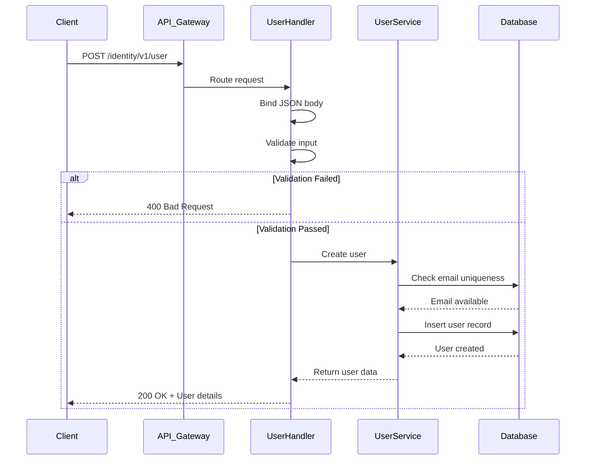
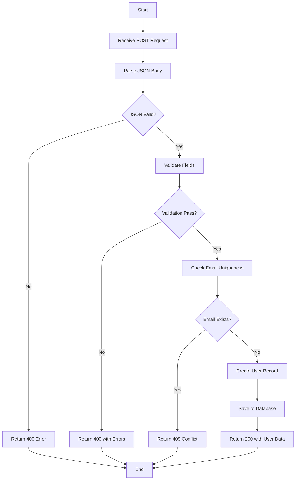

# User Add API

## Overview

This API allows you to create a new user account in the Identity Management System.

### What does this API do?

- **Creates** a new user record in the system
- **Validates** user input data before processing
- **Returns** complete user details upon successful creation

---

## Endpoint Details

| Property | Value |
|----------|-------|
| **Method** | `POST` |
| **Path** | `/identity/v1/user` |
| **Version** | v1 |
| **Module** | Identity |

---

## Request Format

### Headers

```http
Content-Type: application/json
Accept-Language: en|vi  # Optional - defaults to 'en'
```

### Body Parameters

| Field | Type | Required | Description |
|-------|------|----------|-------------|
| `email` | string | Yes | User's email address (must be unique) |
| `password` | string | Yes | User's password (min 8 characters) |
| `full_name` | string | Yes | User's full name |
| `phone` | string | No | User's phone number |
| `avatar_url` | string | No | URL to user's profile picture |

### Example Request Body

```json
{
  "email": "john.doe@example.com",
  "password": "SecurePass123!",
  "full_name": "John Doe",
  "phone": "+84901234567",
  "avatar_url": "https://example.com/avatar.jpg"
}
```

---

## Response Format

### Success Response (200 OK)

```json
{
  "code": 0,
  "message": "success",
  "data": {
    "id": "usr_abc123xyz",
    "email": "john.doe@example.com",
    "full_name": "John Doe",
    "phone": "+84901234567",
    "avatar_url": "https://example.com/avatar.jpg",
    "status": "active",
    "created_at": "2026-01-15T10:30:00Z",
    "updated_at": "2026-01-15T10:30:00Z"
  }
}
```

### Error Responses

#### Validation Error (400 Bad Request)

```json
{
  "code": 400,
  "message": "validation_failed",
  "errors": [
    {
      "field": "email",
      "message": "Email format is invalid"
    },
    {
      "field": "password",
      "message": "Password must be at least 8 characters"
    }
  ]
}
```

#### Duplicate Email (409 Conflict)

```json
{
  "code": 409,
  "message": "email_already_exists",
  "data": null
}
```

#### Internal Server Error (500)

```json
{
  "code": 500,
  "message": "internal_server_error",
  "data": null
}
```

---

## cURL Examples

### Basic Request

```bash
curl -X POST https://api.example.com/identity/v1/user \
  -H "Content-Type: application/json" \
  -H "Accept-Language: en" \
  -d '{
    "email": "john.doe@example.com",
    "password": "SecurePass123!",
    "full_name": "John Doe",
    "phone": "+84901234567"
  }'
```

### With Avatar URL

```bash
curl -X POST https://api.example.com/identity/v1/user \
  -H "Content-Type: application/json" \
  -H "Accept-Language: vi" \
  -d '{
    "email": "jane.smith@example.com",
    "password": "MyP@ssw0rd",
    "full_name": "Jane Smith",
    "phone": "+84912345678",
    "avatar_url": "https://cdn.example.com/avatars/jane.jpg"
  }'
```

---

## Sequence Diagram



---

## Flowchart



---

## Validation Rules

### Email
- Must be valid email format
- Must not already exist in the system
- Maximum length: 255 characters

### Password
- Minimum length: 8 characters
- Recommended: Mix of uppercase, lowercase, numbers, and special characters

### Full Name
- Required field
- Maximum length: 100 characters
- Cannot be empty or whitespace only

### Phone
- Optional field
- Must be valid phone number format if provided
- Recommended format: International (+country code)

### Avatar URL
- Optional field
- Must be valid HTTP/HTTPS URL if provided

---

## Best Practices

### For Developers

1. **Always validate client-side** before sending requests
2. **Handle all error codes** appropriately in your application
3. **Use HTTPS** for all API calls to protect sensitive data
4. **Implement retry logic** for transient failures
5. **Log errors** for debugging purposes

### For Non-Technical Users

1. **Choose strong passwords** that are hard to guess
2. **Use real email addresses** that you can access
3. **Keep your credentials secure** and don't share them
4. **Verify your email** after account creation if required

---

## Common Issues & Solutions

| Issue | Cause | Solution |
|-------|-------|----------|
| 400 Bad Request | Invalid JSON or missing required fields | Check request body format and ensure all required fields are present |
| 409 Conflict | Email already registered | Use a different email address or try login instead |
| 500 Internal Error | Server-side issue | Contact support team with request ID |
| Timeout | Network issues or server overload | Retry the request after a short delay |

---

## Rate Limiting

| Limit | Description |
|-------|-------------|
| 100 requests/minute | Per IP address |
| 10 requests/second | Burst limit |

When rate limited, you'll receive:

```json
{
  "code": 429,
  "message": "rate_limit_exceeded",
  "retry_after": 60
}
```

---

## Security Considerations

⚠️ **Important Security Notes:**

1. **Never expose passwords** in logs or error messages
2. **Use HTTPS only** - never send credentials over HTTP
3. **Implement CSRF protection** for web applications
4. **Rate limit** to prevent brute force attacks
5. **Monitor failed attempts** for suspicious activity

---

## Related APIs

- [User Login](./user-login.md) - Authenticate existing users
- [User Update](./user-update.md) - Modify user information
- [User Delete](./user-delete.md) - Remove user accounts
- [User List](./user-list.md) - Retrieve multiple users

---

## Support

For issues or questions:

- 📧 Email: api-support@example.com
- 💬 Slack: #api-support channel
- 📚 Documentation: https://docs.example.com/identity

---

*Last Updated: January 2026*
*Author: LichTV*
*Version: 1.0.0*