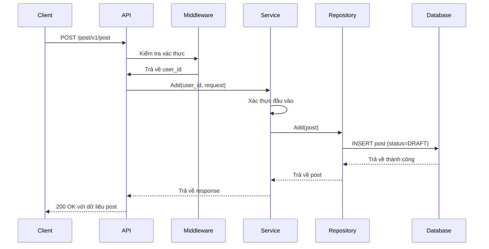
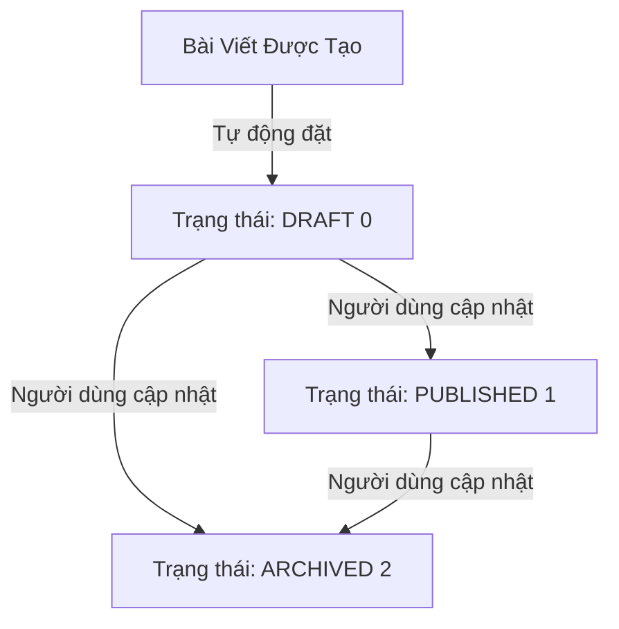

# API: Thêm Bài Viết Mới (Add New Post)

## Tổng Quan (Overview)

API này cho phép người dùng đã xác thực tạo một bài viết mới trong hệ thống. Khi bài viết được tạo, trạng thái của nó sẽ tự động được đặt là **Draft** (Bản nháp).

### API này làm gì?

- Tạo một bài viết mới với tiêu đề, nội dung và URL hình ảnh (tùy chọn)
- Tự động đặt trạng thái bài viết là **Draft** (status = 0)
- Ghi lại thời gian tạo và thời gian sửa đổi
- Gắn bài viết với người dùng đã đăng nhập

### Ai có thể sử dụng API này?

**Chỉ người dùng đã xác thực** - Bạn phải đăng nhập để tạo bài viết.

---

## Chi Tiết API

### Endpoint

```
POST /post/v1/post
```

### Xác Thực (Authentication)

Bắt buộc: **Có** (User ID được trích xuất từ middleware)

### Request Headers

| Header | Giá Trị | Mô Tả |
|--------|---------|-------|
| Content-Type | application/json | Bắt buộc |
| Authorization | Bearer {token} | Bắt buộc để xác thực |

### Request Body

```json
{
  "title": "Bài Viết Đầu Tiên Của Tôi",
  "content": "Đây là nội dung của bài viết",
  "image_url": "https://example.com/image.jpg"
}
```

### Tham Số Request

| Trường | Kiểu | Bắt Buộc | Ràng Buộc | Mô Tả |
|-------|------|----------|-------------|-------------|
| title | string | Có | 3-200 ký tự | Tiêu đề bài viết |
| content | string | Có | Bắt buộc | Nội dung bài viết |
| image_url | string | Không | URL hợp lệ | URL hình ảnh bài viết |

### Response

#### Thành Công (200 OK)

```json
{
  "code": "002.000.000",
  "status": 200,
  "message": "Success",
  "data": {
    "id": 1,
    "user_id": 1,
    "title": "Bài Viết Đầu Tiên Của Tôi",
    "content": "Đây là nội dung của bài viết",
    "image_url": "https://example.com/image.jpg",
    "created_at": "2024-01-01 10:00:00",
    "modified_at": "2024-01-01 10:00:00",
    "status": 0
  }
}
```

#### Phản Hồi Lỗi

| Mã Lỗi | Status | Thông Điệp | Mô Tả |
|------|-------|---------|-------------|
| 002.000.001 | 400 | Not allowed | Truy cập không được phép |
| 002.001.001 | 400 | Title must be between 3 and 200 characters | Độ dài tiêu đề không hợp lệ |
| 002.001.002 | 400 | Content is required | Thiếu nội dung |

---

## Ví Dụ CURL

### Tạo bài viết mới

```bash
curl -X POST "http://localhost:8080/post/v1/post" \
  -H "Content-Type: application/json" \
  -H "Authorization: Bearer YOUR_TOKEN_HERE" \
  -d '{
    "title": "Bài Viết Đầu Tiên Của Tôi",
    "content": "Đây là nội dung của bài viết",
    "image_url": "https://example.com/image.jpg"
  }'
```

### Tạo bài viết không có hình ảnh

```bash
curl -X POST "http://localhost:8080/post/v1/post" \
  -H "Content-Type: application/json" \
  -H "Authorization: Bearer YOUR_TOKEN_HERE" \
  -d '{
    "title": "Bài Viết Đơn Giản",
    "content": "Bài viết này không có hình ảnh"
  }'
```

---

## Sơ Đồ Luồng (Flow Diagram)



---

## Luồng Trạng Thái Bài Viết (Post Status Flow)



---

## Các Trường Hợp Sử Dụng Phổ Biến

### 1. Người dùng tạo bài viết blog

```bash
# Người dùng viết một bài viết blog mới
curl -X POST "http://localhost:8080/post/v1/post" \
  -H "Content-Type: application/json" \
  -H "Authorization: Bearer TOKEN" \
  -d '{
    "title": "Hành Trình Du Lịch Của Tôi",
    "content": "Hôm nay tôi đã đến núi...",
    "image_url": "https://example.com/travel.jpg"
  }'
```

### 2. Người dùng tạo bài viết nháp

```bash
# Bài viết tự động được lưu dưới dạng nháp
curl -X POST "http://localhost:8080/post/v1/post" \
  -H "Content-Type: application/json" \
  -H "Authorization: Bearer TOKEN" \
  -d '{
    "title": "Bài Viết Nháp",
    "content": "Đang làm việc trên bài này..."
  }'
```

---

## Xử Lý Lỗi

### Lỗi Xác Thực (Validation Errors)

| Mã Lỗi | Thông Điệp | Giải Pháp |
|------------|---------|----------|
| 002.001.001 | Title must be between 3 and 200 characters | Đảm bảo tiêu đề từ 3-200 ký tự |
| 002.001.002 | Content is required | Thêm nội dung vào request |
| 002.000.001 | Not allowed | Kiểm tra token xác thực |

### Thực Hành Tốt (Best Practices)

1. **Luôn xác thực** độ dài tiêu đề trước khi gửi
2. **Bao gồm nội dung** trong mọi request
3. **Sử dụng URL hợp lệ** cho image_url
4. **Giữ token an toàn** và làm mới khi hết hạn

---

## Các API Liên Quan

- [Danh Sách Bài Viết](./list.md) - Lấy tất cả bài viết
- [Chi Tiết Bài Viết](./detail.md) - Lấy một bài viết
- [Cập Nhật Bài Viết](./update.md) - Sửa bài viết hiện có
- [Xóa Bài Viết](./delete.md) - Xóa một bài viết

---

## Hỗ Trợ Ngôn Ngữ

API hỗ trợ nhiều ngôn ngữ cho thông báo lỗi:

| Ngôn Ngữ | Thành Công | Tiêu Đề Không Hợp Lệ |
|----------|---------|---------------|
| Tiếng Anh (en) | Success | Title must be between 3 and 200 characters |
| Tiếng Việt (vi) | Thành công | Tiêu đề phải từ 3 đến 200 ký tự |

Đặt ngôn ngữ qua tham số query: `?lang=vi`

---

## Ghi Chú

- Bài viết được tạo với trạng thái **Draft** mặc định
- User ID được tự động trích xuất từ middleware xác thực
- Thời gian được lưu trữ theo định dạng cơ sở dữ liệu
- URL hình ảnh là tùy chọn nhưng được khuyến nghị để trình bày tốt hơn
- Tất cả thời gian sử dụng múi giờ của máy chủ

---

## Phiên Bản

- **Phiên Bản API**: v1
- **Cập Nhật Lần Cuối**: 2024-01-01
- **Tác Giả**: LichTV
- **Module**: Quản Lý Bài Viết
